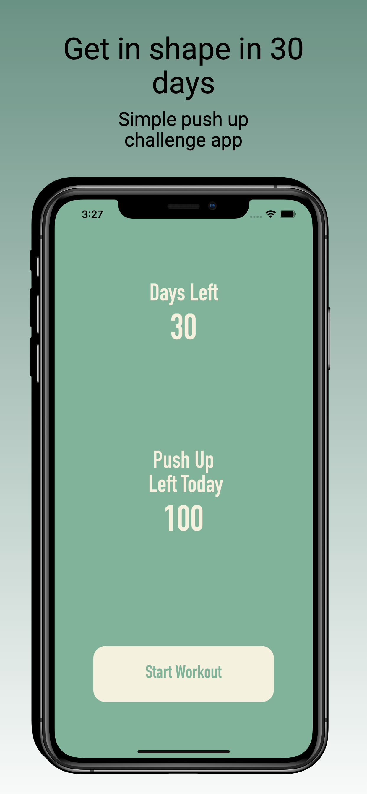
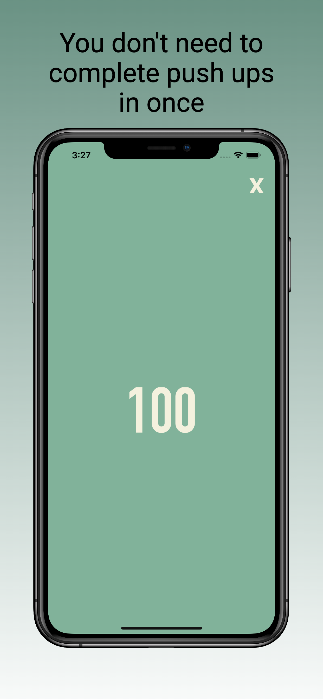
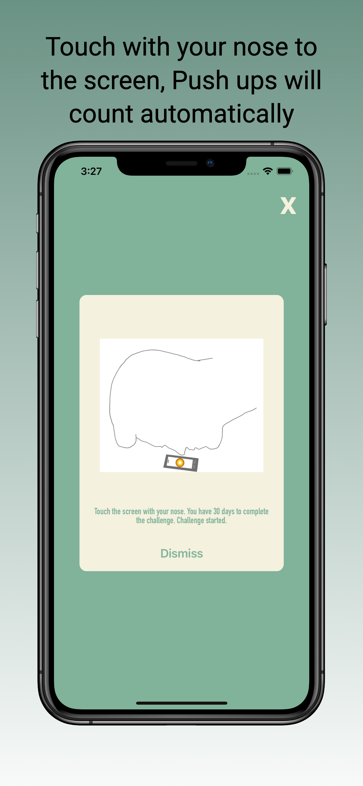

# Push Up Challenge for 30 Days 
Push Up Challenge App with UIKIT

An iOS app for helping count 100 push up daily.

## Features
* Counting 100 push up daily
* If you commit and do 100 pushes for 30 days, you complete the challenge
* The app remembers where you left 
* Sends local notifications
* Touch with your nose to the screen, and the counter will go up

## Technologies
* Swift 5
* UIKit
* User Notifications
* Dates
* Delegate Implementation
* Property Observer

  
   

              
 [LinkedIn](https://www.linkedin.com/in/mutluaydin/)
