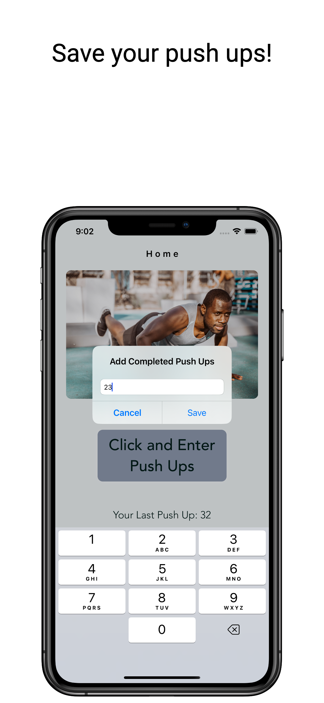
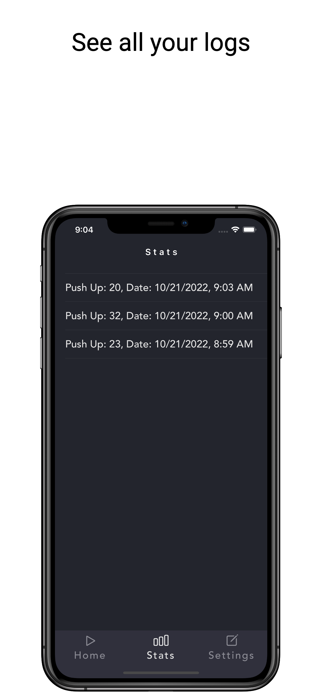

# Push Up Saver 
Get back in shape by tracking your daily push-up counts.
Available in AppStore!

## Features
* Core Data for saving push-up counts and dates
* Set daily reminders and receive local notifications
* Implemented UI programmatically by using Layout Constraint anchors to manage views across different iPhones
* Dark mode/ light mode control through the app
* MVC Design pattern

## Technologies
* Swift 5
* UIKit
* User Notifications
* Delegate Pattern
* Core Data

  
    

              
 [LinkedIn](https://www.linkedin.com/in/mutluaydin/)
